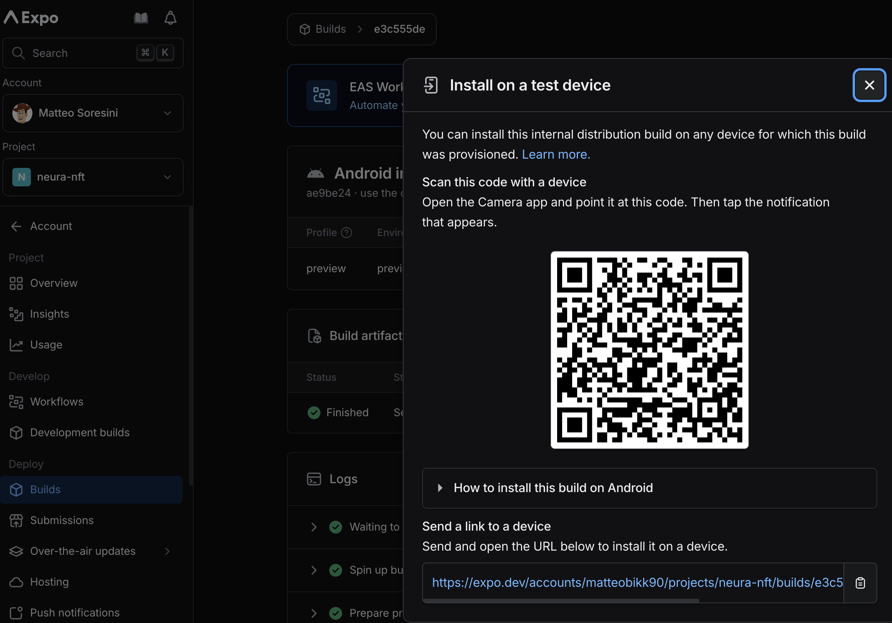

# neura-nft

NeuraNFT is a cross-platform mobile DApp built with `Expo (React Native)`, `Solidity`, and `Node.js`.

It allows users to:

- 💵 View wallet balance and token values in USD
- 👛 Connect a wallet and see detailed wallet info
- 📜 Check last wallet transactions
- 🪙 Track ERC-20 tokens and NFT collections
- 🔥 Explore trending NFTs
- 🎨 Mint new NFTs by uploading metadata to Pinata
- (Coming soon 🚀: AI-powered NFT generation)
- 🧑‍💻 View a profile with key wallet details

---

## ⚠️ Project Status

The project is still **not finalized**.  
A recent deploy introduced a bug that I’m working on fixing.  
You can still run and test the project locally following the instructions below.

⏳ `Note on backend loading time:`
Since the backend is hosted on **Render’s free plan**, the server sleeps after inactivity.  
The **first call after a while may take a few seconds** while the server wakes up.  
Subsequent requests respond normally.

---

## 📲 Test Install (Internal Build)

You can install the latest internal distribution build on a test device:

📌 [Expo build link](https://expo.dev/accounts/matteobikk90/projects/neura-nft/builds/00207446-48ac-4a8f-ba0e-8d2ef34a6ef3)

Or scan the QR code below (saved in the root repo as `install-apk-qr.png`):



---

## 📁 Project Structure

```
neura-nft/
├── apps/
│ ├── backend/ # Express backend (Node.js API, MongoDB, NFT minting)
│ ├── contracts/ # Solidity smart contracts (Hardhat, Solidity)
│ └── mobile/ # React Native app (React Native, TypeScript, Expo, WalletConnect, NativeWind)
├── eslint
├── prettier
├── package.json # Root scripts
├── pnpm-workspace.yaml
└── README.md
```

---

## ✨ Features

### Mobile App (`apps/mobile`)

- Expo + React Native
- WalletConnect (Reown AppKit + ethers.js)
- Zustand for global state
- TanStack Query for API and blockchain data
- Tailwind (NativeWind) theming with dark/light switch
- Lottie animations for loading/error/empty states
- NFT minting flow with image picker and IPFS upload (Pinata)
- Profile & wallet overview screens
- Explore NFTs (owned + trending collections via Alchemy)

### Backend (`apps/backend`)

- Express + TypeScript
- MongoDB with Mongoose
- REST API for users, tokens, NFTs, and minting
- Pinata IPFS integration for metadata storage
- NFT contract interaction via ethers.js
- Authentication-ready middleware & error handling
- Helmet + CORS for security

### Smart Contracts (`apps/contracts`)

- Solidity ERC-721 NFT contract
- Hardhat tooling (scripts, tests, deployment)
- Sepolia testnet deployment
- Minting endpoint wired to backend

---

## 🧰 Deployment

- **Frontend (mobile)** via Expo + EAS (builds for iOS & Android)
- **Backend** hosted on Render (Node.js + MongoDB)
- **Smart Contracts** deployed on Sepolia testnet
- **Pinata/IPFS** for NFT metadata & asset storage

---

## 🛠️ Tooling

- **Language:** TypeScript across backend and mobile
- **Linting/Formatting:** ESLint + Prettier + Import sorting
- **Testing:** Hardhat (contracts), React Native Testing Library
- **State Management:** Zustand
- **Networking:** Axios + TanStack Query

---

## 🛠️ Scripts

### Root

```
pnpm install     # Install all dependencies
pnpm format      # Format all packages
pnpm lint        # Lint and fix all packages
```

### Backend

```
pnpm dev         # Start backend in watch mode (tsx)
pnpm build       # Compile TypeScript + fix path aliases
pnpm start       # Start production server from dist
```

### Contracts

```
pnpm hardhat compile    # Compile contracts
pnpm hardhat test       # Run contract tests
pnpm hardhat run scripts/deploy.ts --network sepolia
```

### Mobile

```
pnpm start       # Start Expo dev server
pnpm build       # Build with EAS

```

---

👤 Author

Matteo Soresini
https://matteosoresini.com

---
